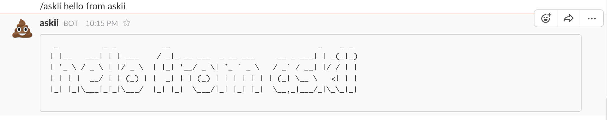

# askii
A custom Slack slash command to generate large ASCII text from user input.

## Setting up for your own Slack Channel
  - Run server script on a server with node installed (compile with babel)
  - Create a custom slash command on your Slack team: http://my.slack.com/services/new/slash-commands
  - Place Slack token within config.js
  - Profit

## Demo 
